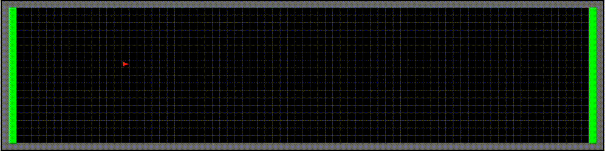

# User Guide

## Making and Customizing Environments
1. Wrap the desired environment class
2. Create static objects and set custom parameters (*only height and width are currently supported) inside the \_\_init\_\_ function
3. Pass the static objects and parameters in when super initializing

```python
class PedestrianEnv20x80(PedestrianEnv):
    def ___init__(self):
        width = 80
        height = 20
        super().__init__(
            width=width,
            height=height,
            pedAgents=None
        )

class TwoLaneRoadEnv30x80(MultiLaneRoadEnv):
    def __init__(self):
        width = 30
        height = 80

        lane1 = Lane(
            topLeft=(5, 0),
            bottomRight=(14, 79),
            direction=1,
            inRoad=1,
            laneID=1,
            posRelativeToCenter=-1
        )
        lane2 = Lane(
            topLeft=(15, 0),
            bottomRight=(24, 79),
            direction=3,
            inRoad=1,
            laneID=2,
            posRelativeToCenter=1
        )
        road1 = Road([lane1, lane2], roadID=1)

        sidewalk1 = Sidewalk(
            topLeft=(0, 0),
            bottomRight=(4, 79),
            sidewalkID=1
        )

        sidewalk2 = Sidewalk(
            topLeft=(25, 0),
            bottomRight=(29, 79),
            sidewalkID=2
        )

        crosswalk1 = Crosswalk(
            topLeft=(5, 40),
            bottomRight=(24, 45),
            crosswalkID=1,
            overlapRoad=1,
            overlapLanes=[1, 2]
        )

        super().__init__(
            road=road1,
            sidewalks=[sidewalk1, sidewalk2],
            crosswalks=[crosswalk1],
            width=width,
            height=height
        )
```

4. Register the child class environment with gym-minigrid right under the child class

```python
register(
    id='PedestrianEnv-20x80-v0',
    entry_point='pedgrid.envs.pedestrian.PedestrianEnv:PedestrianEnv20x80'
)

register(
    id='TwoLaneRoadEnv30x80-v0',
    entry_point='gym_minigrid.envs.pedestrian.MultiLaneRoadEnv:TwoLaneRoadEnv30x80'
)
```

5. Make the environment with gym in the test script
```python
env = gym.make('PedestrianEnv-20x80-v0')

env = gym.make('TwoLaneRoadEnv30x80-v0')
```

In the future, parameters will be incorporated into gym's make function.

## Adding Simple Pedestrians, Vehicles, and Road Infrastructure to an Environment

### Dynamic Agents
Dynamic agents are added to the environment in the test script before or during simulation.

Example Pedestrian:
```python
ped = PedAgent(id=1, position=(x, y), direction=Direction.North, maxSpeed=5, speed=5)
env.addPedAgent(ped)
```

Alternatively, a list of pedestrians can be appended at once:
```python
peds = [ped_1, ped_2, ped_n]
env.addPedAgents(peds)
```

Example Vehicle:
```python
veh = Vehicle(id: 1, topLeft=(x1, x2), bottomRight=(x2, y2), direction=Direction.East, maxSpeed=20, speed=20, inRoad=1, inLane=1)
env.addVehicleAgent(veh)
```

Similarly, a list of vehicles can be appended with:
```python
env.addVehicleAgents()
```

### Static Objects
Static objects are added when the environment class is made and customized.

Example Lane:
```python
lane = Lane(
    topLeft=(x1, y1),
    bottomRight=(x2, y2),
    direction=Direction.South,
    inRoad=1,
    laneID=1,
    posRelativeToCenter=-1
)
```

Example Road:
```python
road = Road(lanes=[lane1, lane2], roadID=1)
```

Example Sidewalk:
```python
sidewalk = Sidewalk(
    topLeft=(x1, y1),
    bottomRight=(x2, y2),
    sidewalkID=1
)
```

Example Crosswalk:
```python
crosswalk1 = Crosswalk(
    topLeft=(x1, y1),
    bottomRight=(x2, y2),
    crosswalkID=1,
    overlapRoad=1,
    overlapLanes=[1, 2] # laneIDs of the lanes
)
```

## Rendering Speed
Suppose we want to run a simulation for 1,000 steps. Rendering each step would take considerable time. Thus, rendering can be turned off by commenting out env.render() or controlled to only render at interval steps via modulus. This way, the simulation will run much quicker.

## Using the MetricCollector
The MetricCollector observes an environment for a defined number of time steps and can be declared as such:

```python
metricCollector = MetricCollector(env, stepsToIgnoreAtTheBeginning = , stepsToRecord = )
```

Suppose stepsToIgnoreAtTheBeginning = 100 and stepsToRecord = 1000; then, the MetricCollector will observe and maintain the metrics for time steps 101 to 1100.

## PedestrianEnv

### Description
This environment models a simple grid for behavior simulation involving pedestrians, containing a G<sub>m x n</sub> grid with customizable length m and height n. PedestrianEnv only supports pedestrian agents, or PedAgents. No other static or dynamic objects are supported. Pedestrians may be added or removed any time during simulation.

### Action Space
PedGrid utilizes **_Action_** objects with properties _agent_ with the agent reference and _action_ as an enum. Two enum classes define dynamic agent movement in PedestrianEnv.
* LaneAction
    * .KEEP: agent keeps the current lane
    * .LEFT: agent shifts a tile to the left
    * .RIGHT: agent shifts a tile to the right
* ForwardAction
    * .KEEP: pedestrian agent moves forward by agent.speed tiles


**Note:** When a pedestrian agent exceeds the end of the environment during a forward action, they automatically turn around in the opposite direction.

Starting State:
All pedestrian agents are placed at their initial positions.

Episode End:
The episode ends once the set number of steps has been run.

Arguments:
```python
import gym-minigrid
env = gym.make('[id of your registered PedestrianEnv environment]')
```

## MultiLaneRoadEnv

### Description
This environment models a grid that wraps PedestrianEnv for behavior simulation involving both pedestrians and vehicles. MultiLaneRoadEnv supports pedestrians and vehicles as dynamic agents and sidewalks, crosswalks, and one road with multiple lanes as static objects. Dynamic agents may be added or removed any time during simulation; however, static objects are not designed to be removed.

### Action Space
PedGrid utilizes **_Action_** objects with properties _agent_ with the agent reference and _action_ as an enum. Three enum classes define dynamic agent movement in MultiLaneRoadEnv.
* LaneAction
    * .KEEP: agent keeps the current lane
    * .LEFT: agent shifts a tile to the left
    * .RIGHT: agent shifts a tile to the right
* ForwardAction
    * .KEEP: pedestrian agent moves forward by agent.speed tiles
* VehicleAction
    * .KEEP: vehicle agent moves forward by agent.speed tiles

**Note:** When a pedestrian agent exceeds the end of the environment during a forward action, they automatically turn around in the opposite direction. Vehicle agents will terminate the simulation when they exceed the end of the environment.

Starting State:
All static objects are put in place and dynamic agents are placed at their initial positions.

Episode End:
The episode ends once the set number of steps has been run or if a vehicle moves out of bounds.

Arguments:
```python
import gym-minigrid
env = gym.make('[id of your registered MultiLaneRoadEnv environment]')
```

## Tutorials

### Tutorial 1 - PedestrianEnv
**Simple Pedestrian Moving Forward and Shifting Left/Right with Equal Probability**



1. Defining and registering the environment - PedestrianEnv.py

```python
class PedestrianEnv20x80(PedestrianEnv):
    def ___init__(self):
        width = 80
        height = 20
        super().__init__(
            width=width,
            height=height,
            pedAgents=None
        )

register(
    id='PedestrianEnv-20x80-v0',
    entry_point='gym_minigrid.envs.pedestrian.PedestrianEnv:PedestrianEnv20x80'
)
```

2. Creating the agent and defining behavior - Tutorial1PedAgent.py

```python
from gym_minigrid.lib.Action import Action
from gym_minigrid.lib.ForwardAction import ForwardAction
from gym_minigrid.lib.LaneAction import LaneAction
from .PedAgent import PedAgent
import numpy as np

class Tutorial1PedAgent(PedAgent):
    
    def parallel1(self, env) -> Action:
        return Action(self, ForwardAction.KEEP)
        # return None

    def parallel2(self, env) -> Action:
        return np.random.choice([Action(self, LaneAction.LEFT), Action(self, LaneAction.RIGHT)], p=(0.5, 0.5))
        # return None
```

3. Writing the test script - tutorial1.py

```python
import time
import logging
import gym
import gym_minigrid
from gym_minigrid.agents import *

env = gym.make('PedestrianEnv-20x80-v0')
env.reset()

ped = Tutorial1PedAgent(id=1, position=(10, 10), direction=Direction.East, maxSpeed=3, speed=3)
env.addPedAgent(ped)

for i in range(100):

    obs, reward, done, info = env.step(None)
    
    if done:
        "Reached the goal"
        break

    env.render()

    if i % 10 == 0:
        logging.info(f"Completed step {i+1}")

    time.sleep(0.5)
```

### Tutorial 2 - MultiLaneRoadEnv
**Two pedestrians and two vehicles moving forward in their respective directions with one crosswalk, two lanes, and two sidewalks**


1. Defining and registering the environment - MultiLaneRoadEnv.py

```python
class TwoLaneRoadEnv30x80(MultiLaneRoadEnv):
    def __init__(self):
        width = 30
        height = 80

        lane1 = Lane(
            topLeft=(5, 0),
            bottomRight=(14, 79),
            direction=1,
            inRoad=1,
            laneID=1,
            posRelativeToCenter=-1
        )
        lane2 = Lane(
            topLeft=(15, 0),
            bottomRight=(24, 79),
            direction=3,
            inRoad=1,
            laneID=2,
            posRelativeToCenter=1
        )
        road1 = Road([lane1, lane2], roadID=1)

        sidewalk1 = Sidewalk(
            topLeft=(0, 0),
            bottomRight=(4, 79),
            sidewalkID=1
        )

        sidewalk2 = Sidewalk(
            topLeft=(25, 0),
            bottomRight=(29, 79),
            sidewalkID=2
        )

        crosswalk1 = Crosswalk(
            topLeft=(5, 40),
            bottomRight=(24, 45),
            crosswalkID=1,
            overlapRoad=1,
            overlapLanes=[1, 2]
        )

        super().__init__(
            road=road1,
            sidewalks=[sidewalk1, sidewalk2],
            crosswalks=[crosswalk1],
            width=width,
            height=height
        )

register(
    id='TwoLaneRoadEnv30x80-v0',
    entry_point='gym_minigrid.envs.pedestrian.MultiLaneRoadEnv:TwoLaneRoadEnv30x80'
)
```

2. Creating the agents and defining behavior - Tutorial2PedAgent.py & Tutorial2Vehicle.py

**Tutorial2PedAgent.py**
```python
from gym_minigrid.lib.Action import Action
from gym_minigrid.lib.ForwardAction import ForwardAction
from gym_minigrid.lib.LaneAction import LaneAction
from gym_minigrid.agents.PedAgent import PedAgent
import numpy as np

class Tutorial2PedAgent(PedAgent):
    
    def parallel1(self, env) -> Action:
        return Action(self, ForwardAction.KEEP)
        # return None

    def parallel2(self, env) -> Action:
        return None
```

**Tutorial2Vehicle.py**
```python
from gym_minigrid.agents.Vehicle import Vehicle
from gym_minigrid.lib.Action import Action
from gym_minigrid.lib.VehicleAction import VehicleAction

class Tutorial2Vehicle(Vehicle):
    
    def parallel1(self, env):
        return Action(self, VehicleAction.KEEP)
```

3. Writing the test script - tutorial2.py
```python
import time
import gym
import gym_minigrid
from gym_minigrid.agents import *
import logging

env = gym.make('TwoLaneRoadEnv30x80-v0')       
env.reset()

v1 = Tutorial2Vehicle(1, (7, 10), (12, 19), 1, 5, 5, 1, 1)
v2 = Tutorial2Vehicle(2, (17, 60), (22, 69), 3, 5, 5, 1, 2)
p1 = Tutorial2PedAgent(id=3, position=(2,5), direction=Direction.South, maxSpeed=3, speed = 3)
p2 = Tutorial2PedAgent(id=4, position=(27,74), direction=Direction.North, maxSpeed=3, speed = 3)

env.addVehicleAgent(v1)
env.addVehicleAgent(v2)
env.addPedAgent(p1)
env.addPedAgent(p2)

for i in range(10):

    obs, reward, done, info = env.step(None)
    
    if done:
        "Reached the goal"
        break

    env.render()

    if i % 10 == 0:
        logging.info(f"Completed step {i+1}")

    time.sleep(0.5)
```